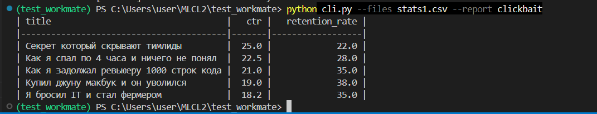
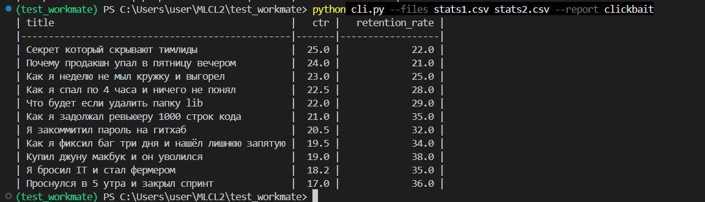
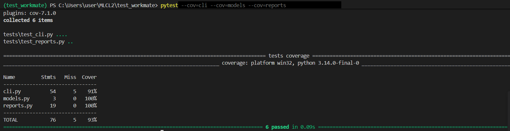

# Clickbait Analyzer CLI

Консольная утилита на Python для парсинга статистических данных из CSV-файлов и автоматического формирования аналитических отчетов по кликбейту. Проект спроектирован с учетом принципов SOLID, легко масштабируется и полностью покрыт тестами.

## 🚀 Основные возможности
* **Мультифайловый парсинг:** Одновременная загрузка и обработка нескольких CSV-файлов со статистикой.
* **Гибкая система отчетов:** Структурированный вывод аналитики в терминал в виде аккуратных таблиц.
* **Высокое покрытие тестами:** Логика приложения проверена автоматическими тестами.
* **Чистый код:** Проект отформатирован и проверен с помощью современного линтера `ruff`.

## 📸 Демонстрация работы
Ниже представлены примеры работы утилиты при анализе файлов:

### Запуск с одним файлом данных:


### Анализ и агрегация данных из двух файлов:


## 🛠 Архитектура и масштабируемость
Кодовая база разделена на независимые модули, что упрощает поддержку проекта:
* `models.py` — содержит строго типизированные классы данных (Data Classes). Позволяет быстро добавлять новые сущности и структуры данных при изменении формата логов.
* `reports.py` — отвечает за бизнес-логику генерации отчетов. Реализован реестр отчетов `REPORTS` (паттерн "Фабрика" / Словарь стратегий), благодаря чему добавление нового типа отчета не требует изменения существующего кода генерации.
* `cli.py` — интерфейс командной строки, отвечающий за парсинг аргументов, валидацию и оркестрацию работы утилиты.

## 📦 Установка и запуск

### Требования
* Python 3.10+
* Зависимости из `requirements.txt` (используется библиотека `tabulate` для красивого вывода таблиц)

### Инструкция по запуску
1. Клонируйте репозиторий и перейдите в папку проекта.
2. Установите базовые зависимости:
   ```bash
   pip install -r requirements.txt
   ```
3. Запустите генерацию отчета `clickbait`, передав нужные файлы:
   ```bash
   python cli.py --files stats1.csv stats2.csv --report clickbait
   ```

## 🧪 Тестирование и качество кода
Для проверки работоспособности используется фреймворк `pytest`. Покрытие кода тестами составляет **93%**.

### Запуск тестов и проверка покрытия:
1. Установите зависимости для разработки:
   ```bash
   pip install -r requirements-dev.txt
   ```
2. Запустите тесты с генерацией отчета о покрытии:
   ```bash
   pytest --cov=cli --cov=models --cov=reports
   ```

### Отчет о покрытии кода (Code Coverage):


## 📂 Структура проекта
* `cli.py` — точка входа, разбор аргументов командной строки.
* `models.py` — модели данных приложения.
* `reports.py` — фабрика отчетов и логика агрегации метрик.
* `tests/` — папка с модульными и интеграционными тестами.
* `requirements.txt` / `requirements-dev.txt` — списки основных и dev-зависимостей.
